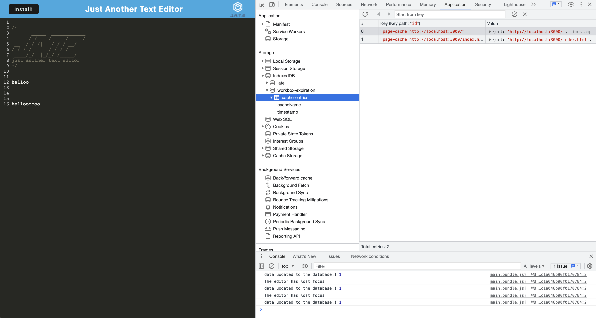
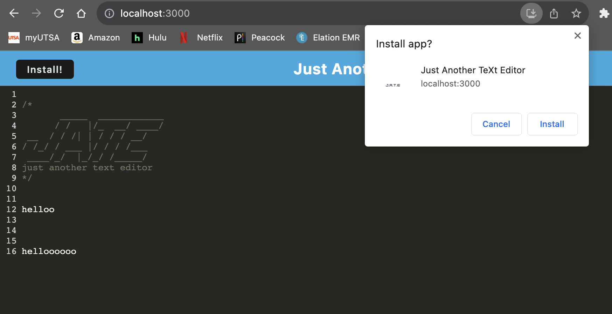

# text-editor

A Progressive Web Application text editor that runs in the browser online and offline and features a number of data persistence techniques. Now you can edit your text anytime, anywhere!

## Deployed Heroku App
https://powerful-depths-25565-4292b952147c.herokuapp.com/

## Table of Contents
- [Table of Contents](#table-of-contents)
- [Description](#description)
- [Usage](#usage)
- [Mock Image](#mock-image)
- [Installation](#installation)
- [License](#license)
- [Contributors](#contributors)
- [Tests](#tests)
- [Questions](#questions)

## Description
As a social media startup, I have created API for my social network that uses a NoSQL database to allow my website to handle large amounts of unstructured data. Users of this platform can add/remove friends, post thoughts and recieve reactions. 

## Mock Image

 

 

## Usage 
To use this application, run a `npm run start:dev` and go to `localhost:3000`. You may also view the app at Heroku https://powerful-depths-25565-4292b952147c.herokuapp.com/ . Note  that you can edit the text both online and offline. Chrome dev tools will allow you to view indexedDB and manifest.jsaon. If you choose, you may use the button in the top L corner of the app to download it onto you local drive! 

## Installation 
The user must clone the repository onto their local drive. Install dependencies using `npm i` and start using `npm run start:dev`. May trial while online and offline to ensure data is cached in both scenarios

## License 
This project is covered under the MIT license.

## Contributors
I am the sole contributor of this project. However, this project was built with the help of in class modules, specifically the Student Mini Project. Additional links that were helpful linked below: 
https://web.dev/articles/codelab-make-installable
 
https://developer.mozilla.org/en-US/docs/Web/API/IndexedDB_API

## Tests 
N/A

## Questions 
For any additional questions or information, please contact me, additionally, feel free to view my other projects: 
- Github: [shaffachaudhry](https://github.com/shaffachaudhry)
